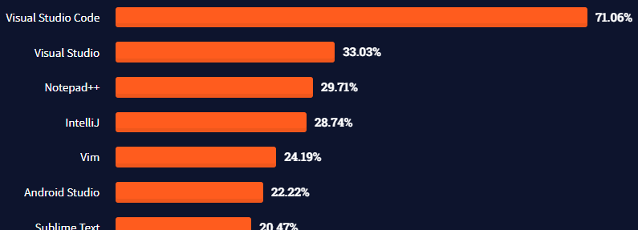
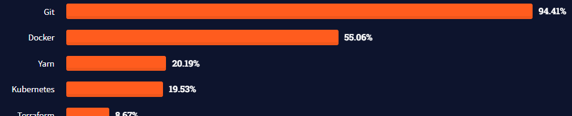

# day01

## IDE

통합개발환경 IDE (Integrated Development Environment)는 코드 작성, 컴파일, 디버깅 등 프로그램 개발에 필요한 기능들을 한곳에 모아둔 프로그램이다.

IDE가 생기기 이전에는 텍스트 에디터에서 코드를 작성하고, 별도의 컴파일러로 컴파일하고 따로 실행하는 등 처리할 일이 여러가지 있었다. IDE가 생긴 이후에는 자동완성, 코드 하이라이트 등 생산성 향상에 많은 도움이 되고있다.

IDE 중에서 visual studio code는 stack overflow survey 2021 (82277 응답) 에서 압도적 1위 IDE로 선정되었다.

visual studio code는 텍스트 에디터라는 의견도 있다. 하지만 기능 확장으로 IDE 처럼 기능하고, 스택오버플로 에서 인정하였으니 이제 IDE라고 불러도 무방하다.

실제 사용시에도 IDE와 별 차이가 없다. 그 예로 vscode 내부에는 javascript 인터프리터가 포함되지 않는다. 그러나 실행시 설치된 브라우저, node.js를 자동으로 찾아 setting 한다.

## Git, GitHub

버전 관리 시스템, 리누스 토르발스가 만들었다.

stack overflow survey 2021 (54943 응답) 에서 1위 tool 으로 선정되었다.

참고로 git과 github는 다른 것이다. github는 git을 사용한 서비스라고 보는것이 정확하다. github 에서 제공하는 다양한 기능들(일정 관리, 질의응답, ...)은 git 의 기능이 아니다. 마이크로소프트의 힘이다!

## JavaScript, node.js

### var, let, const

javascript의 변수 선언은 var, let, const 3가지다.
기존에는 var 하나만 존재했으나 ES6 에서 let, const 가 추가되었다.
let, const는 블록 유효 범위를 가지고 중괄호{} 범위에서만 유효하다.
그 외에도 var에 없는 중복선언금지 등의 제약이 추가된 것이 let이다.
var의 문제를 해결하기 위해 추가된 만큼 let을 적극 활용하는것이 오류를 줄일 수 있어보인다.

### 비동기

javascript는 비동기 처리에 특화되어 있다.
웹(서버, 클라이언트)의 특성상 네트워크 통신으로 데이터를 송수신 하는 경우가 많을 것이다.

그런데 만약 data1요청->data1수신->data2요청->data2수신->data3... 처럼 처리하면 오래걸린다.

그래서 data1요청,data2요청,...data1수신,data2수신... 처럼 오래걸리는 처리는 뒤로 미루고, 다음 기능을 먼저 처리한다.

요청한 data가 이후에 처리할 내용에 필요하다면 비동기 처리는 피해야한다.
undefined 만 남게되기 때문이다.

## 참고

-   [Stack Overflow Survey 2021](https://insights.stackoverflow.com/survey/2021)
-   [동기 비동기](https://opentutorials.org/course/3332/21132)
