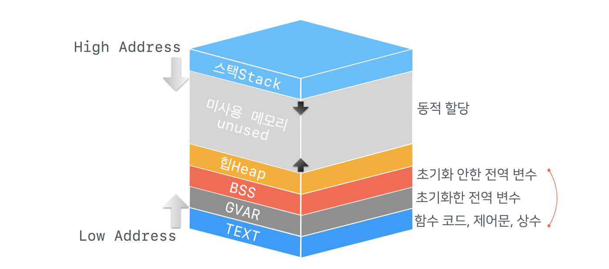

# day04

## Memory

현대의 컴퓨터는 모두 폰 노이만 구조를 따른다.
지금은 내장 메모리 방식이 당연하게 사용된다.
그 정도의 구조를 그때 당시에 설계한 노이만은 어느정도의 천재인걸까.

|    천재, 존 폰 노이만)     |       폰 노이만 구조       |
| :------------------------: | :------------------------: |
|  |  |

메모리는 컴퓨터의 모든것을 담는다.

데이터는 물론이고, CPU에서 동작할 명령어까지 메모리가 담당한다.
그만큼이나 메모리 관리가 중요하다는 것이다.

메모리에 대한 올바른 접근은 컴퓨터 작동의 핵심이다.

예를들어 펭귄 이미지가 메모리에 로드되어 있다고 가정하자.
CPU에서 실행된 명령이 이미지 파일을 읽는 작업이라면 올바르게 작동할 것이다.
하지만 만약 문제가 생겨서 텍스트, 음악, 동영상 심지어 CPU 명령으로 읽는다면 문제가 생길것이다.
여기서 설명한 잘못 실행된 CPU 명령도 메모리에서 읽은 것이다.

결국 컴퓨터가 올바르게 동작하려면 올바른 메모리 접근이 중요하다는 것이다.

## 프로세스 메모리 구조

프로세스가 실행되면 운영체제가 비어있는 메모리 영역을 프로세스에 할당한다.

그 비어있는 영역 안에서 프로세스가 영역을 나누어 사용한다.
그것이 프로세스 메모리 구조다.

### TEXT 섹션

프로그램의 함수 코드, 제어문, 상수 등 변경되지 않는 값들이 할당되는 영역이다.

### GVAR/BSS 섹션

Scope가 정해지지 않은 전역 변수 등

### HEAP 섹션

동적으로 할당되는 영역

### STACK 섹션

함수 호출 시 지역변수, 매개변수, 리턴값 등
